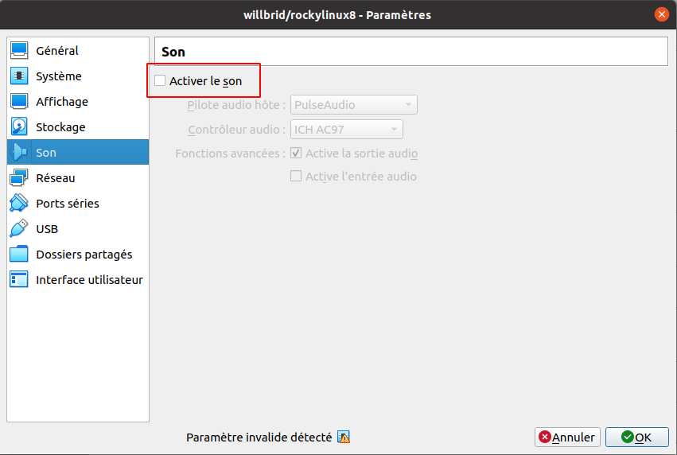

# Création de notre propre fichier vagrant box [Part1]
Nous supposerons que nous utilisons virtualbox **6.1.34**.
 
Dans cette partie, nous allons créer notre machine virtuelle virtualbox pour le système rocky linux 8.
 
Nous lançons virtualbox, puis nous suivrons les différentes étapes ci-dessous.

- Nous cliquons sur le menu **Machine** puis son sous menu **Nouvelle**

- Une interface s'ouvre. Nous configurons les valeurs de paramètres tels que présentées par l'image ci-après : 

- Une fois terminée, nous cliquons sur le bouton **Suivant** . Une interface de configuration de la mémoire de la machine virtuelle s'ouvre. Nous mettons la même valeur telle que définie sur la capture ci-après :

- Une fois la mémoire configuré, nous cliquons sur le bouton **Suivant** . Une interface de configuration du disque dur virtuel s'ouvre. Nous choisissons la même option telle définie sur la capture ci-après :

Puis nous cliquons sur le bouton **Créer**

- Une nouvelle interface s'ouvre où nous allons choisir le type de fichier de disque dur. Dans notre cas le type **VDI**. Puis nous cliquons sur le bouton **Suivant** .

- Une nouvelle interface s'ouvre où nous choisissons l'option de stockage du disque dur virtuel sur le disque dur physique. Puis nous cliquons sur le bouton **Suivant** .

- Une nouvelle interface s'ouvre où nous définissons la taille et l'emplacement du disque dur virtuel. Puis nous cliquons sur le bouton **Créer** .

- Pour cette machine virtuelle créée, nous la sélectionnons, puis nous faisons un clic droit et nous cliquons sur configuration.
-- Nous désactivons le contrôleur usb

-- Nous désactivons le son

Notre machine virtuelle est prête !